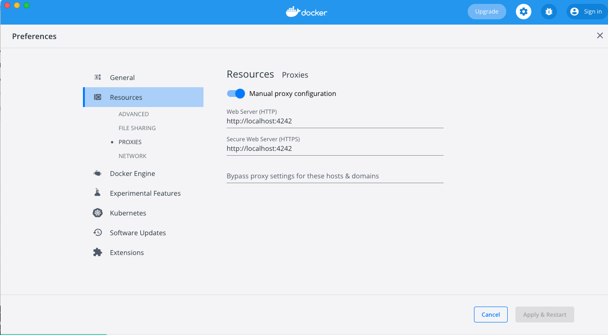

# How to set up `mitmproxy` to test Hermit update

1. On laptop (macOS), clone this repo

   ```bash
   git clone https://github.com/syncom/mitmproxy-hermit.git
   cd mitmproxy-hermit/
   ```

2. Install `mitmproxy`

   ```bash
   brew install mitmproxy
   ```

   The CA certificate for `mitmproxy` has been copied from
   `~/.mitmproxy/mitmproxy-ca-cert.cert` of the local machine to
   [mitmproxy-ca-cert.cer](./mitmproxy-ca-cert.cer) of this repo. If
   your local `mitmproxy`'s CA certificate is different, replace
   `mitmproxy-ca-cert.cer` in the cloned repository with yours.

3. Build Docker image for testing

   ```bash
   docker build --tag ubuntu:mitm .
   ```

4. Proxy Docker traffic. In Docker Desktop,
`Preferences/Resources/PROXIES`, turn on "Manual proxy configuration",
and use `http://localhost:4242` as the value for "Web Server (HTTP)" and
"Secure Web Server (HTTPS)". Restart Docker Desktop.

   

5. On laptop, start `mitmproxy` in passthrough mode.

   ```bash
   mitmproxy --listen-port 4242
   ```

6. Run Docker image

   ```bash
   docker run -it ubuntu:mitm
   ```

   Inside Docker VM shell (run as `root` user)

   ```bash
   # Install Hermit from canary channel
   curl -fsSL https://github.com/cashapp/hermit/releases/download/canary/install.sh | /bin/bash
   # Add to PATH
   export PATH="/root/bin:$PATH"
   # Show version
   hermit version # For my test run, 819b5ff (canary)
   # Run hermit init, and activate hermit
   mkdir project
   cd project
   hermit init .
   . bin/activate-hermit
   # Show version inside environment
   hermit version # For my test run same as above, 819b5ff (canary)
   ```

7. On laptop host, build custom Hermit for `linux-amd64`

   ```bash
   make GOOS=linux GOARCH=amd64 CHANNEL=canary VERSION=testversion build
   ```

   Rename `build/hermit-linux-amd64.gz` to `test-hermit-linux-amd64.gz`,
   and put it in the top-level directory in this repository.

8. On host, exit from `mitmproxy` console (press `q` and select
`yes`), and run the `mitmdump` to override the downloaded
`hermit-linux-amd64.gz` with the custom built one.

   ```bash
   mitmdump -s rewrite_file.py --listen-port 4242 | tee mitmproxy.log
   ```

9. In Docker VM shell, test `hermit update` in the already activated
environment. This should get `test-hermit-linux-amd64.gz` to replace the
Hermit binary.

   ```bash
   project🐚  hermit update
   project🐚  hermit version # Should be "testversion (canary)"
   project🐚  hermit validate env .
   project🐚  echo $? # Should be 0
   project🐚  deactivate-hermit
   # More testing with the custom Hermit
   mkdir ../project1
   hermit version # Should be "testversion (canary)"
   hermit init .
   . bin/activate-hermit
   project1🐚  hermit version # Should be "testversion (canary)"
   project1🐚  hermit validate env .
   project1🐚  echo $? # Should be 0
   # Clear cache and try custom Hermit again
   project1🐚  deactivate-hermit
   rm -rf ~/.cache/hermit
   . bin/activate-hermit
   project1🐚  hermit version # Should be "testversion (canary)"
   project1🐚  hermit validate env .
   project1🐚  echo $? # Should be 0
   ```

Remember to revert your proxy configuration in Docker Desktop after
testing is done.